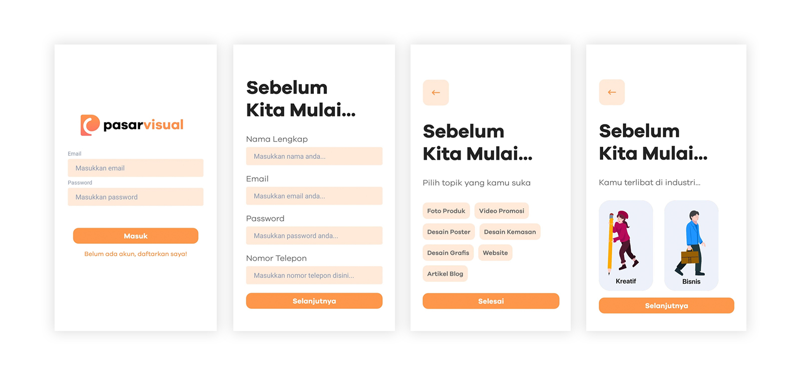
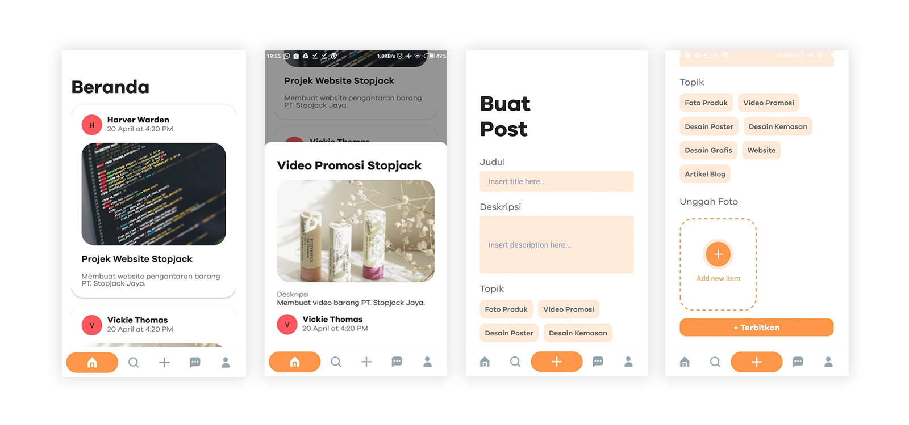
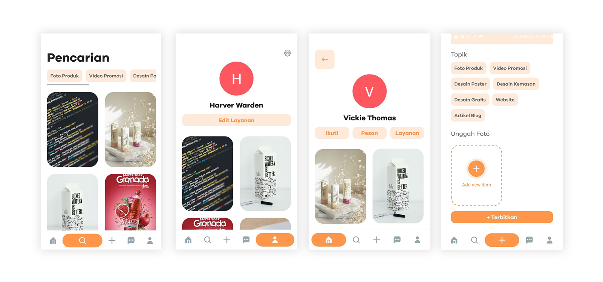
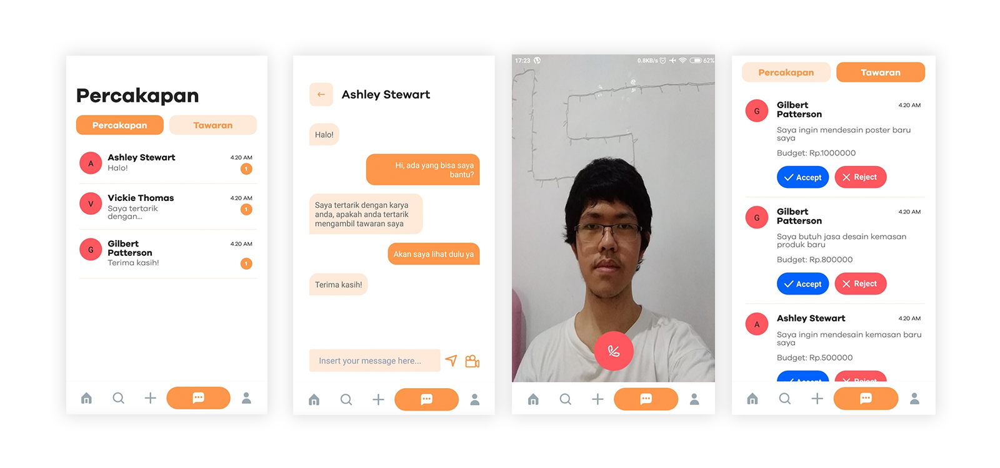
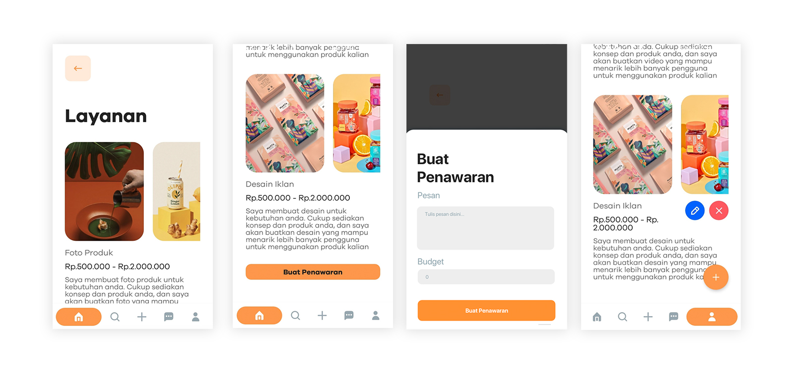

### 💡 About the App
The SME sector plays a very important role because it has a huge influence on the wheels of the Indonesian economy. Minister of Cooperatives and SMEs Teten Masduki said that 60% of the national Gross Domestic Product is supported by the MSME sector and absorbs 97% of the total workforce.

However, most of them are less able to compete, one of which is in creating a brand, design and packaging. These factors can add value to business products, introduce business products to the wider community through digital media, attract potential customers, and maintain consumer loyalty. Meanwhile, SMEs are still constrained by creating attractive designs and content for their products.

This is where digital marketing agency services can help business people improve their sales performance by implementing a marketing strategy. It was found that digital marketing strategies have an effect of up to 78% on the competitive advantage of SMEs in marketing their products.

SMEs need people in the digital marketing field, but they tend to get troubled finding the right people to do the job. They need a platform where they can discover talents, hire them, and also transact safely in using digital marketers services.

Therefore, we created a platform called PasarVisual, which is a platform that is devoted to bringing together MSME business people and digital marketers, so that business people can easily find and use digital marketing services to help them strengthen product exposure from their business in digital media.

### 👀 Preview

###### Onboarding Interface

When starting the app, user will be prompted to sign in or sign up. When signing up, user will see an onboarding screen to get a grasp of PasarVisual. User will then create their account, and specify their user type; business or creative. User will also be asked for content preferences, so that PasarVisual can show related contents to your liking.

###### Home

In the Home, user can scroll and see their followings' posts. User can see Creatives posts to get inspired, or potentially hire them for a creative job. For Creatives, they can also see job postings from Business that are interested in hiring talents.

###### Discover

In Discover, user can search for more posts from everyone, by filtering the contents with tags you are interested in.

###### Message

In Message, user can chat and video call with other people from any role. This can be used to talk casually, or discussing projects between Creative and Business.

Another tab is used to track offers. Creatives or Business can track the people who applied or hired them for a job. Initially, user can accept or reject the offer. Once accepted, processes for payment, and project status.

##### Service

Creatives has an additional space for them to publish their pricelist, to get other people a good idea of the services they provide and an idea of their price range.

### 👨🏻‍💻 Tech Stack
PasarVisual is fully built with React Native, with Expo environment. PasarVisual use Firebase for storing database and file storage.

